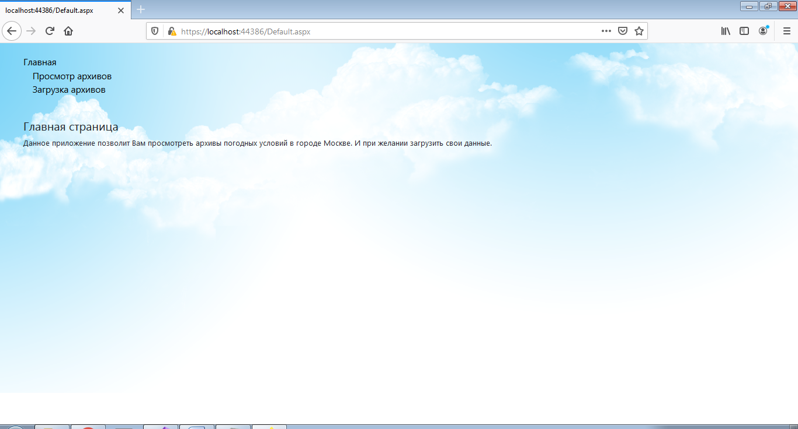
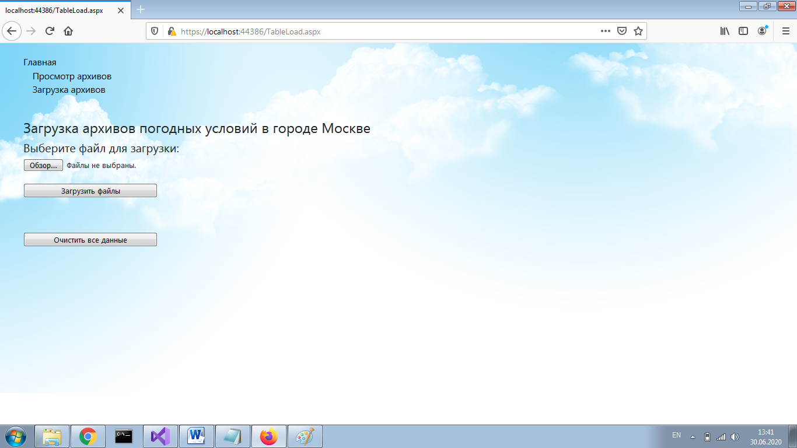
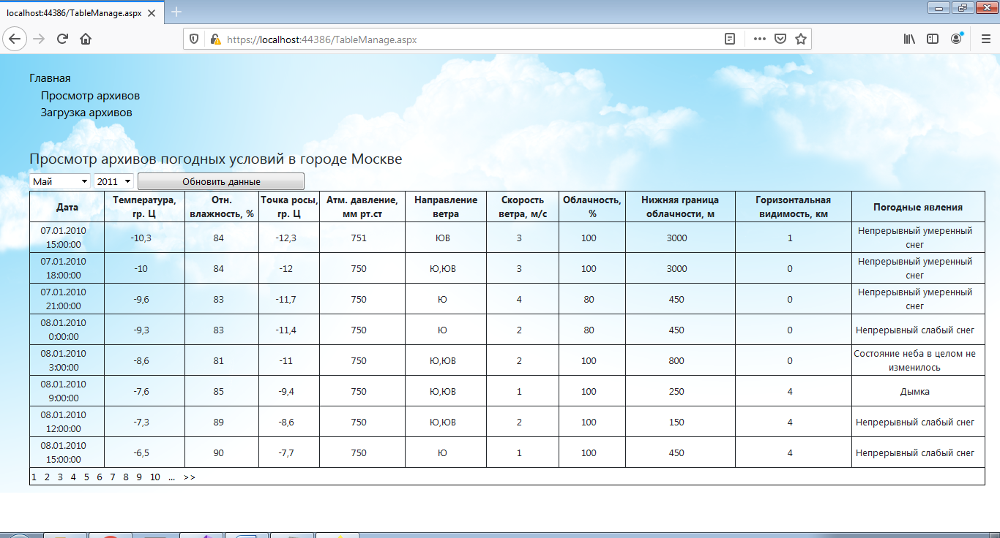

# Test App about Weather

## Структура проекта
На данный момент 5 главных структур:

|        Имя        |                         Предназначение                            | Скрин  |
|:-----------------:| ----------------------------------------------------------------- |--------|
|    Master.master  | Шаблон страницы							|	 |
|    Default.aspx   | Главная страница                                			| 1.png	 |
|   TableLoad.aspx  | Страница загрузки архивов погодных условий в городе Москве	| 2.png  |
| Table Manage.aspx | Страница просмотра архивов погодных условий в городе Москве 	| 3.png  |
|    Weather.cs	    | Класс, на котором основана БД                                     |	 |

Главная страница

Страница загрузки архивов погодных условий в городе Москве

Страница просмотра архивов погодных условий в городе Москве
